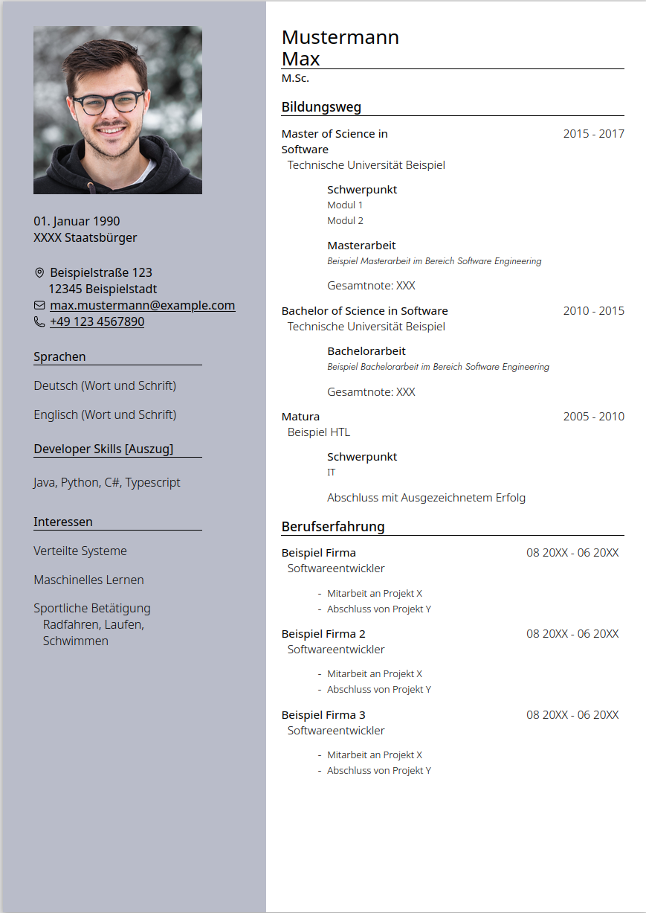

# Python HTML CV Generator

HTML CV Generator is a simple Python-based tool for generating HTML CVs (Curriculum Vitae) or Resumes with minimal dependencies. It offers an easy and efficient way to create professional CVs in HTML format.

## Key Features

- **Simplicity**: This project aims to provide a straightforward solution for generating HTML CVs without unnecessary complexities.
- **Minimal Dependencies**: It has been designed to have minimal dependencies, making it easy to set up and use.
- **Configuration via YAML**: The CV generation process is configured using a simple YAML file, allowing for easy customization of various sections and content.

## Getting Started

To get started with HTML CV Generator, follow these simple steps:

1. Create a new virtual environment using `venv` or any other preferred method. This step is recommended to isolate the project dependencies.

   ```shell
   python3 -m venv myenv      # Create a new virtual environment
   source myenv/bin/activate # Activate the virtual environment
   ```
2. Clone the repository: `git clone https://github.com/dominik-fenzl/html-cv-generator`
3. Install the necessary dependencies: `pip install -r requirements.txt`
4. Configure your CV by editing the `input.yaml` file to add your personal details, sections, and content.
5. Run the CV generator script: `python generate_cv.py`
6. Voila! Your HTML CV (output.html) will be generated and ready to use.

Additionally, instructions are provided on how to convert the generated HTML CV into a PDF file and compress it properly for easier sharing:

To export the generated `output.html` to a PDF, please follow these steps:

1. Open the `output.html` file in a web browser.
2. Access the print settings for the file.
3. Make the following changes in the print settings:
   - Set the "Border" option to "None".
   - Enable the "Print Background" option.
   - Disable the "Print Header and Footer" option.
4. Proceed with printing the file, selecting the option to save as PDF.
5. Save the printed file as a PDF document.

To compress the created PDF file, use the following command:

```shell
gs -sDEVICE=pdfwrite -dCompatibilityLevel=1.4 -dPDFSETTINGS=/printer -dNOPAUSE -dQUIET -dBATCH -sOutputFile=output-compressed.pdf your-created-pdf-file.pdf
```

Replace `your-created-pdf-file.pdf` with the actual name of your generated PDF file. This command utilizes Ghostscript (`gs`) with specific settings to optimize and compress the PDF.

By following these steps, you can generate a PDF version of your CV and compress it to reduce file size for easier sharing.

Please ensure that you have Ghostscript installed on your system to execute the compression command.

## Example HTML CV



This image showcases an example of the generated HTML CV using our project. 
Please note that the actual content and design may vary based on the data provided.


## Example Configuration

An example configuration file named `input.example.yaml` is provided as a template. You can use this file as a starting point and customize it according to your requirements. To get started, make a copy of `input.example.yaml` and rename it to `input.yaml`. Then, edit the `input.yaml` file to add your personal details, sections, and content.

Please note that the `input.example.yaml` file is provided for reference and should be modified to reflect your own information.


## Customizing the Template

To customize the appearance and layout of the generated HTML CV, you can modify the `template.html` file. This file serves as the HTML template that defines the structure and styling of the CV. You can use the powerful Jinja2 templating syntax to include dynamic content from the `config.yaml` file.

Make changes to the `template.html` file to suit your desired design, keeping in mind the placeholders and variables that can be replaced with content from the YAML configuration.

## Hot Reloading

For convenient development and immediate preview of changes, the project includes a hot reloading feature. Follow the steps below to utilize hot reloading:

1. Start the watcher script using the command:

```shell
python watcher.py
```

2. Open the `output.html` file in a web browser.
3. Whenever you make changes to the `template.html` or `config.yaml` files, simply refresh the browser to see the latest updates reflected in the rendered CV.

Alternatively, you can use an HTML server for live preview. For example, if you are using Visual Studio Code, you can right-click on the `output.html` file and select "Open with Live Server". This method eliminates the need for manual refreshes, ensuring you always see the most recent changes. However, please note that you still need to start the watcher script beforehand for automatic updates.